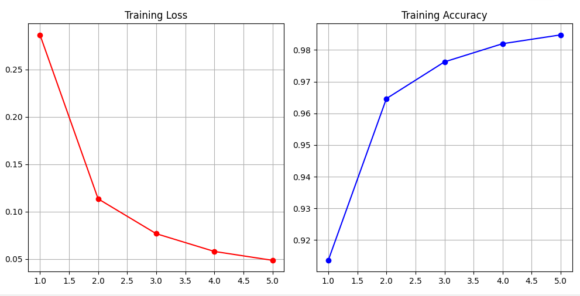
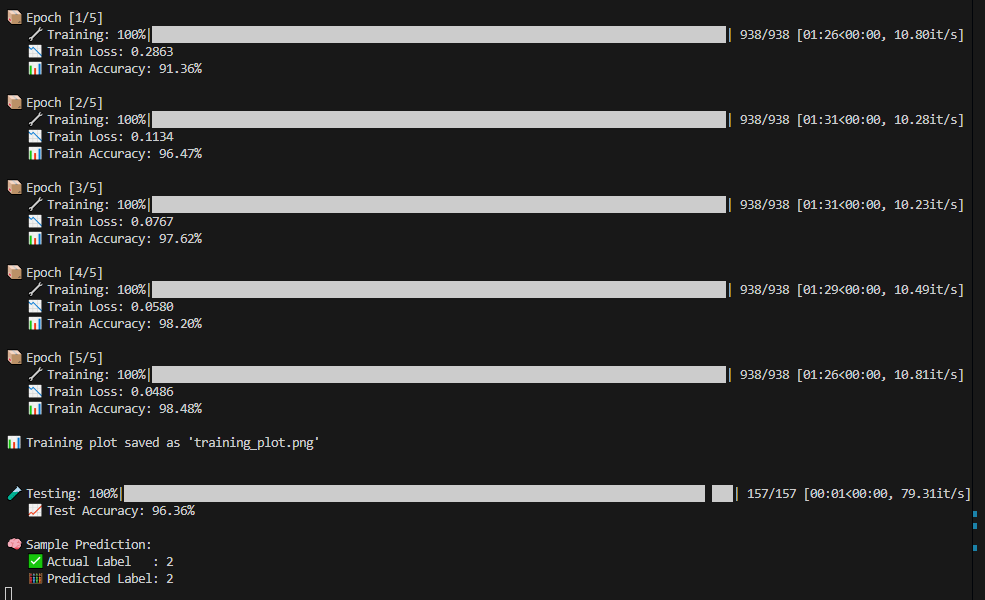
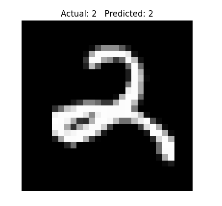

# 🧠 Predictive Coding for MNIST Classification

This project implements a **biologically inspired predictive coding neural network** to classify handwritten digits from the MNIST dataset. Unlike traditional feedforward networks trained with backpropagation, this architecture performs learning and inference by **minimizing local prediction errors** through **iterative updates**.

## 🧪 Overview

- **Framework:** PyTorch
- **Dataset:** MNIST (handwritten digit classification)
- **Learning Paradigm:** Supervised predictive coding
- **Key Features:**
  - Feedback and lateral connections
  - Iterative latent state inference
  - Modular architecture and training pipeline
  - Visualization of training curves and predictions

## 🔧 Prerequisites

Before running this project, make sure you have the following installed:

- Python 3.8 or higher
- pip (Python package manager)

## ⚙️ Technologies Used

| Technology     | Purpose                                 |
|----------------|------------------------------------------|
| **PyTorch**     | Deep learning framework                 |
| **Torchvision** | MNIST dataset utilities and transforms |
| **Matplotlib**  | Training loss/accuracy plotting         |
| **TQDM**        | Progress bar during training            |
| **NumPy**       | Numerical operations (implicitly used) |

## 🏗️ Project Structure

```bash
mnist-predictive-coding
├── data.py # MNIST data loaders
├── model.py # Predictive coding network & layers
├── train.py # Training logic
├── test.py # Evaluation logic
├── utils.py # Visualization & helper functions
├── main.py # Entry point for training and testing
├── requirements.txt # Python dependencies
└── training_plot.png # Output training plot (auto-generated)
```

## 🚀 Getting Started

### 1. Clone the repository

```bash
git clone https://github.com/yourusername/mnist-predictive-coding.git
cd mnist-predictive-coding
```

### 2. Create a virtual environment (optional but recommended)

```bash
python -m venv venv
source venv/bin/activate  # On Windows: venv\Scripts\activate
```

### 3. Install dependencies

```bash
pip install -r requirements.txt
```

### 4. Run the training script

```bash
python main.py
```

This will:

- Train the predictive coding model for 5 epochs

- Plot training loss and accuracy

- Evaluate on test data

- Predict a random test digit

## 📈 Example Output

- Training plot: Saved as training_plot.png

- Sample prediction: Displayed during the final phase of main.py

## 🖼️ Visual Examples

### 🧠 Model Training Plot



---

### ✅ Console Output Snapshot

Displays a typical output during model training and testing.


---

### 🔍 Single Sample Prediction

Illustrates model inference on a randomly chosen digit from the MNIST test set.


## 🛠️ Implementation Highlights

- `PCLayer`: Feedforward, feedback, and lateral weight components

- `PredictiveCodingNet`: Three-layer model with internal state inference

- `infer()`: Iterative latent state updates to minimize error

- `compute_loss()`: Uses cross-entropy on the top latent state

- `train()` and `test()`: Modular functions for running experiments

## Contact

Implemented with 💚 in PyTorch by **MELOS**

For issues, suggestions, or contributions, feel free to open an issue.
